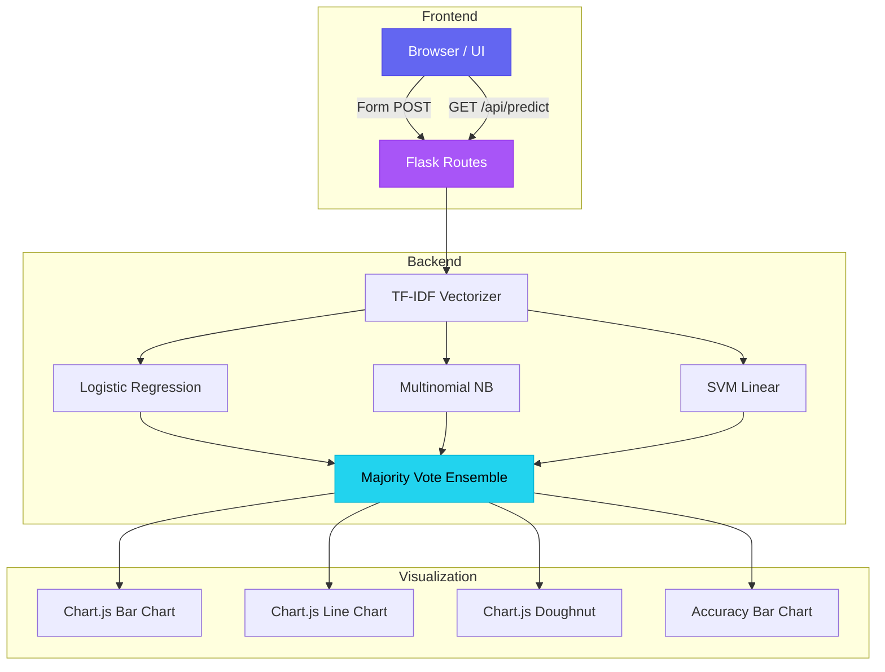

# 📊 Sociyoo — Social Media Brand Sentiment Analysis

<div align="center">


**An ML-powered sentiment intelligence dashboard for monitoring brand reputation across five social media platforms in real time.**

[Features](#-features) · [Demo](#-demo) · [Quick Start](#-quick-start) · [API](#-api-endpoint) · [Architecture](#-architecture) · [Tech Stack](#-tech-stack) · [License](#-license)

</div>

---

## 🚀 Features

| Feature | Description |
|---------|-------------|
| 🔍 **Interactive Classification** | Paste any social media post and get instant sentiment prediction |
| 📊 **Brand Comparison Charts** | Grouped bar charts comparing positive/neutral/negative sentiment per brand |
| 📈 **Sentiment Trend Lines** | Chronological score tracking to spot reputation shifts early |
| 🤖 **Ensemble ML Pipeline** | Majority-vote across Logistic Regression, Naive Bayes & SVM |
| 📱 **Multi-Platform Support** | Instagram, Twitter (X), WhatsApp, Facebook, Telegram |
| 🎯 **Probability Breakdown** | Visual progress bars for per-class confidence scores |
| 📉 **Model Accuracy Dashboard** | Training accuracy, cross-validation scores & class distribution |
| 🔌 **REST API** | JSON endpoint (`/api/predict`) for programmatic access |
| 🩺 **Health Check** | `/health` endpoint for deployment monitoring |
| 🌙 **Premium Dark UI** | Glassmorphism, animations, responsive design with Inter typography |

---

## 🎯 Demo

### Dashboard Overview
The main dashboard provides an at-a-glance view of brand sentiment across platforms with interactive charts.

### Interactive Classification
Users can select a platform, enter a brand name, and paste a social media message to get real-time sentiment analysis with probability breakdowns and per-algorithm predictions.

### Model Performance
The performance section shows ensemble accuracy, per-algorithm comparison (horizontal bar chart), and training data distribution (doughnut chart).

---

## ⚡ Quick Start

### Prerequisites
- Python 3.9 or higher
- pip (Python package manager)

### Installation

```bash
# 1. Clone the repository
git clone https://github.com/bsaiyashwant/brand_sentiment_analysis.git
cd brand_sentiment_analysis

# 2. Create a virtual environment
python -m venv .venv

# 3. Activate it
# Windows
.venv\Scripts\activate
# macOS / Linux
source .venv/bin/activate

# 4. Install dependencies
pip install -r requirements.txt

# 5. Run the application
python app.py
```

The app will start at **http://127.0.0.1:5000** 🎉

### Environment Variables (Optional)

| Variable | Default | Description |
|----------|---------|-------------|
| `PORT` | `5000` | Server port |
| `FLASK_ENV` | `development` | Set to `production` for production mode |
| `FLASK_SECRET_KEY` | `sociyoo-dev-...` | Secret key for sessions (change in production) |

---

## 🔌 API Endpoint

### `POST /api/predict`

Programmatically classify sentiment for any social media text.

**Request:**

```bash
curl -X POST http://127.0.0.1:5000/api/predict \
  -H "Content-Type: application/json" \
  -d '{
    "platform": "twitter",
    "brand": "BrandA",
    "text": "I love the new update, it works perfectly"
  }'
```

**Response:**

```json
{
  "platform": "twitter",
  "brand": "BrandA",
  "text": "I love the new update, it works perfectly",
  "predicted_sentiment": "positive",
  "confidence": {
    "positive": 0.87,
    "neutral": 0.09,
    "negative": 0.04
  },
  "per_model": {
    "Logistic Regression": { "label": "positive", "probabilities": { ... } },
    "Multinomial Naive Bayes": { "label": "positive", "probabilities": { ... } },
    "Support Vector Machine": { "label": "positive", "probabilities": { ... } }
  }
}
```

### `GET /health`

Health check for monitoring / deployment.

```json
{
  "status": "healthy",
  "models_loaded": 3,
  "training_samples": 215
}
```

---

## 🏗 Architecture



---

## 🧠 ML Pipeline

### Feature Extraction
- **TF-IDF Vectorizer** with uni-grams and bi-grams
- Platform and brand name prepended to text for context-aware features

### Classifiers
| Algorithm | Type | Configuration |
|-----------|------|---------------|
| Logistic Regression | Linear | `max_iter=1000`, probability enabled |
| Multinomial Naive Bayes | Probabilistic | Default priors |
| Support Vector Machine | Kernel-based | `kernel='linear'`, probability enabled |

### Ensemble Strategy
- **Majority Voting**: Each classifier casts one vote; the label with the most votes wins
- Probability estimates from Logistic Regression are surfaced for confidence display

### Evaluation
- Training accuracy computed on full labelled dataset
- 5-fold stratified cross-validation for generalization estimates

---

## 🛠 Tech Stack

| Layer | Technology |
|-------|-----------|
| **Backend** | Python 3.9+, Flask 3.0 |
| **ML** | Scikit-learn 1.4 (TF-IDF, LogReg, NB, SVM) |
| **Frontend** | HTML5, CSS3 (glassmorphism), Jinja2 |
| **Charts** | Chart.js 4.x |
| **Fonts** | Google Fonts — Inter |
| **Deployment** | Gunicorn (production WSGI) |

---

## 📁 Project Structure

```
brand_sentiment_analysis/
├── app.py                 # Flask app, ML pipeline, routes & API
├── requirements.txt       # Python dependencies
├── LICENSE                # MIT License
├── README.md              # This file
├── static/
│   └── style.css          # Premium dark-mode stylesheet
└── templates/
    └── index.html         # Dashboard template (Jinja2 + Chart.js)
```

---

## 📋 Use Cases

- **Campaign Monitoring** — Track sentiment shifts during marketing campaigns
- **Crisis Detection** — Early warning system for negative sentiment spikes
- **Feature Feedback** — Gauge user reaction to product updates
- **Competitor Comparison** — Side-by-side brand reputation analysis
- **Social Listening** — Aggregate opinions from multiple platforms

---

## 🤝 Contributing

1. Fork the repository
2. Create a feature branch (`git checkout -b feature/amazing-feature`)
3. Commit your changes (`git commit -m 'Add amazing feature'`)
4. Push to the branch (`git push origin feature/amazing-feature`)
5. Open a Pull Request

---

## 📄 License

This project is licensed under the MIT License — see the [LICENSE](LICENSE) file for details.

---

<div align="center">

**Built with ❤️ using Flask, Scikit-learn & Chart.js**

</div>
